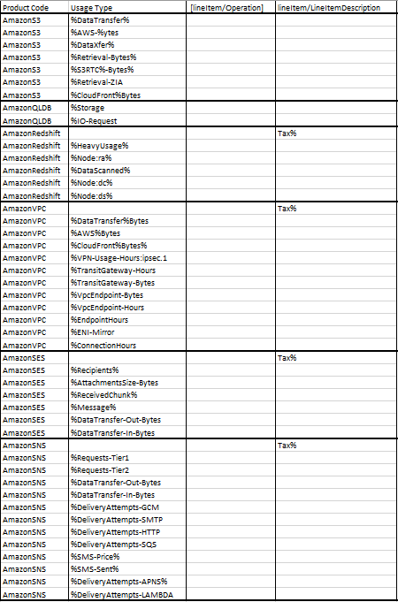
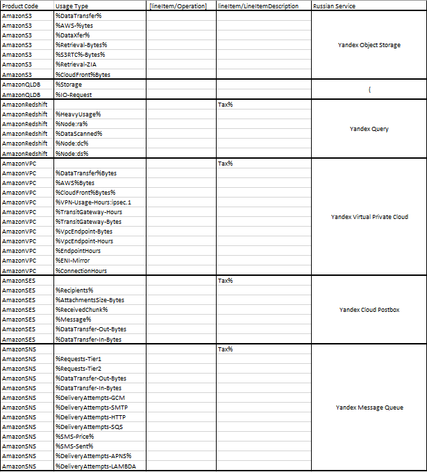
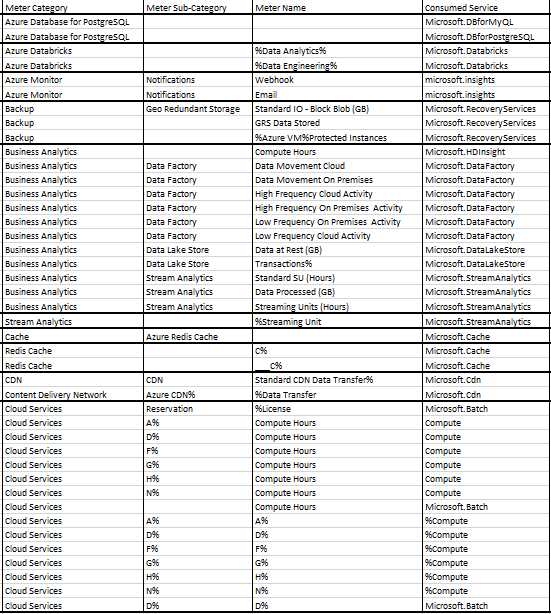
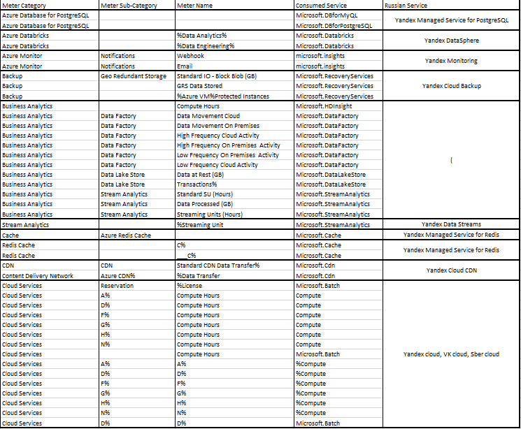

# Аналитическая лабораторная работа

## Состав команды:

Колсанов Ярослав K3223 *руководитель*

Маноменов Иван K3223

Царёв Александр K3221

Екатерина Ульянова K3222

### Цель работы

Знакомство с облачными сервисами. Понимание уровней абстракции над инфраструктурой в облаке. Формирование понимания типов потребления сервисов в сервисной-модели. Сопоставление сервисов между разными провайдерами. Оценка возможностей миграции на отечественные сервисы.

### Дано: 
1. Слепок данных биллинга от провайдера после небольшой обработки в виде SQL-параметров.
2. Google с документациями провайдера
### Необходимо:
Подобрать каждому сервису международного провайдера российский аналог. Заполнить информацию о российских сервисах в таблице

## AWS

### Изначальная таблица

### Встретившиеся сервисы Amazon

**1. Amazon S3 (Simple Storage Service)** – сервис хранения объектов, обеспечивающий хранение и защиту необходимого объема данных для практически любого примера использования: для озёр данных, облачных и мобильных приложений, и.т.д.

**Российский аналог : Yandex Object Storage** - Yandex Object Storage — это универсальное масштабируемое решение для хранения данных. Оно подходит как для высоконагруженных сервисов, которым требуется надежный и быстрый доступ к данным, так и для проектов с невысокими требованиями к инфраструктуре хранения.

**2. Amazon QLDB (Quantum Ledger Database)** – полностью управляемая база данных реестров, обеспечивающая прозрачный, неизменяемый и проверяемый криптографическими методами журнал транзакций.

**Российский аналог : Not found.** Вероятно связано с непопулярностью криптотранзакций в РФ

**3. Amazon Redshift** – сервис, использующий SQL для анализа структурированных/частично структурированных данных в хранилищах данных, операционных базах данных и озерах данных с помощью оборудования, спроектированного AWS, и машинного обучения.

**Российский аналог: Yandex Query** - Интерактивный сервис виртуализации данных для инженеров и аналитиков, который позволяет выполнять аналитические и потоковые запросы в режиме реального времени к структурированным и частично структурированным данным с помощью YQL — диалекта SQL.

**4. Amazon VPC (Virtual Private Cloud)** – сервис для контроля над виртуальной сетевой средой: распределением ресурсов, подключением, безопасностью.

**Российский аналог: Yandex Virtual Private Cloud** - сервис для создания облачных сетей, которые используются для передачи информации внутри облака и соединения облачных ресурсов с интернетом.

**5. Amazon SES (Simple Email Service)** – облачный поставщик сервисов электронной почты, который может быть интегрирован в любое приложение для автоматизации больших объёмов электронной почты.

**Российский аналог: Yandex Cloud Postbox** - сервис отправки транзакционных почтовых сообщений.

**6. Amazon SNS (Simple Notification Service)** – сервис уведомлений, использующий 2 метода отправки сообщений: A2A и A2P. A2A обеспечивает высокую пропускную способность для обмена push-уведомлениями между распределенными системами, микросервисами и бессерверными приложениями. A2P позволяет отправлять текстовые SMS-сообщения, push-уведомления и электронные письма.

**Российский аналог: Yandex Message Queue** - сервис очередей для обмена сообщениями между компонентами распределённых приложений и микросервисов.

### Итоговая таблица

## Azure

### Изначальная таблица

### Встретившиеся сервисы Azure

**1. Azure Database for PostgreSQL** - это служба реляционной базы данных в облаке Майкрософт на основе реляционной базы данных с открытым исходным кодом PostgreSQL.

**Российский аналог: Yandex Managed Service for PostgreSQL** - сервис для развертки и поддержки кластеров серверов PostgreSQL в инфраструктуре Yandex Cloud

**2. Azure Databricks**  — единая, открытая платформа аналитики для создания, развертывания, совместного использования и обслуживания корпоративных данных, аналитики и решений искусственного интеллекта в масштабе.

**Российский аналог: Yandex DataSphere** — это сервис для ML-разработки полного цикла, который позволяет использовать все преимущества облачных технологий

**3. Azure Monitor** - комплексное решение для мониторинга для сбора, анализа и реагирования на данные мониторинга из облачных и локальных сред.

**Российский аналог: Yandex Monitoring**.Сервис позволяет собирать, хранить и отображать метрики, а также настраивать алерты и присылать по ним уведомления.

**4. Azure Backup** — сервис, обеспечивающей резервное копирование одним щелчком, которое масштабируется в зависимости от ваших потребностей в хранилище резервных копий.

**Российский аналог: Yandex Cloud Backup** - Сервис для создания резервных копий и восстановления виртуальных машин.

**5. Azure Business Analytics** - корпоративная служба аналитики, которая ускоряет извлечение аналитических сведений в разных хранилищах данных и системах больших данных.

**Российский аналог: Not found**

**6.Azure Stream Analytics** — это полностью управляемая подсистема потоковой обработки, предназначенная для анализа и обработки больших объемов потоковых данных

**Российский аналог: Yandex Data Streams** - Yandex Data Streams — масштабируемый сервис для управления потоками данных в режиме реального времени.

**7.Azure Cache/Redis cache** - предоставляет хранилище данных в памяти на основе программного обеспечения Redis.

**Российский аналог: Yandex Managed Service for Redis** - помогает разворачивать и поддерживать кластеры серверов Redis 6.2 и 7.0 в инфраструктуре Yandex Cloud. 

**8. Content Delivery Network (CDN)** - является распределенной сетью серверов, которая позволяет эффективно доставлять пользователям веб-содержимое. Сеть CDN хранит кэшированное содержимое на пограничных серверах в расположениях точки присутствия, расположенных близко к конечным пользователям, чтобы свести к минимуму задержку.

**Российский аналог: Yandex Cloud CDN** - Сервис для организации сети распространения контента

**9. Azure cloud Services** - платформа для создания и масштабирования приложений в облаке

**Российские аналоги: Yandex Cloud, VK Cloud, Sber Cloud, e.t.c.**

### Итоговая таблица

