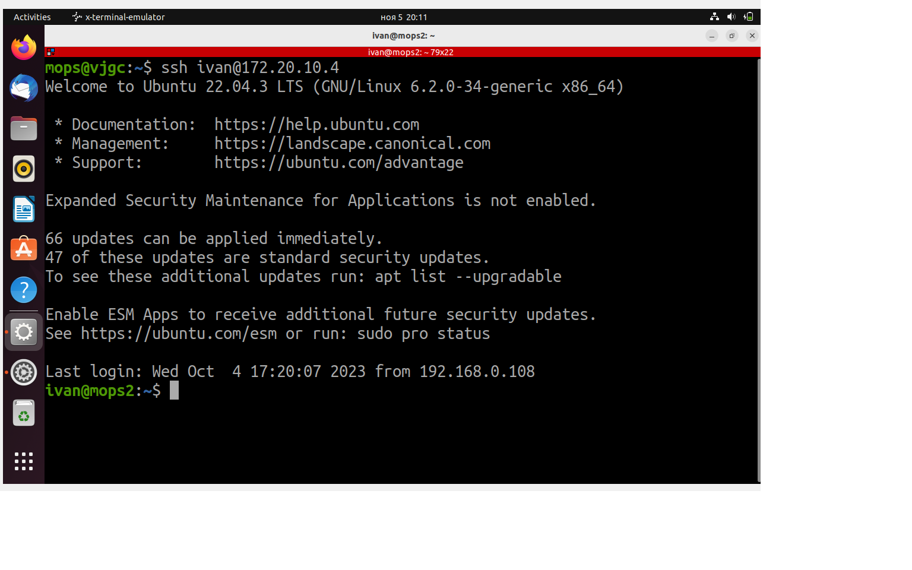
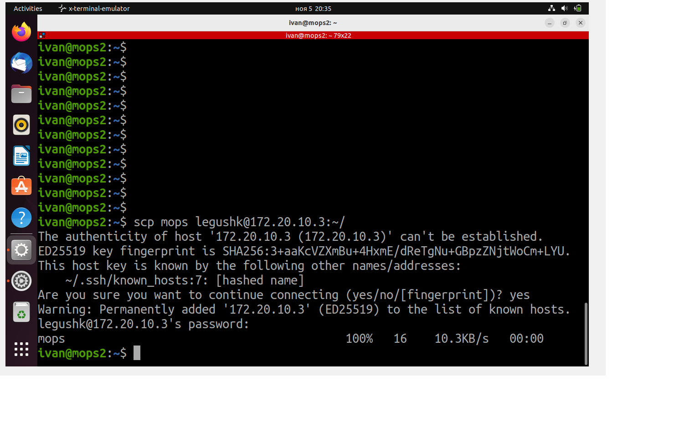
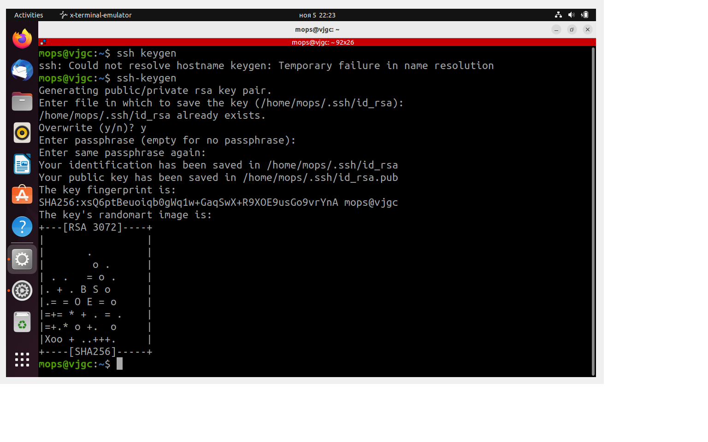
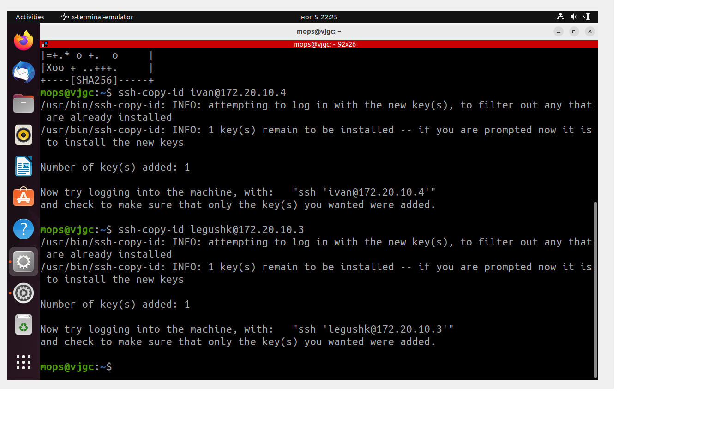
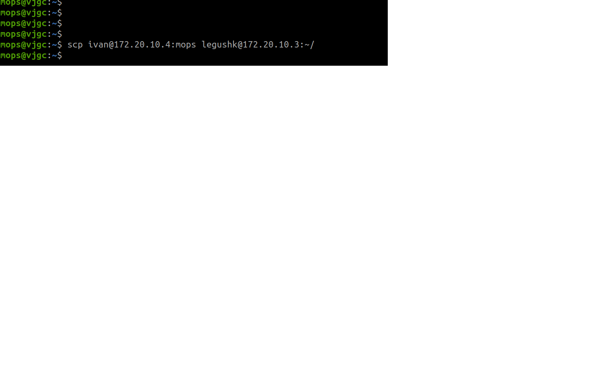
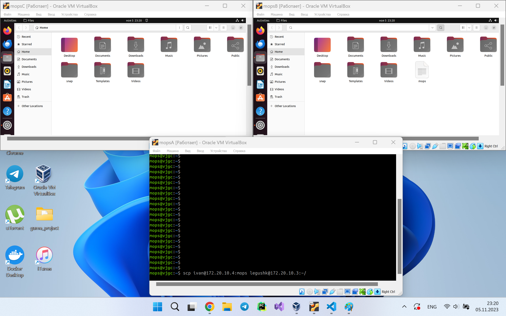

# Лабораторная работа 1

### Цель работы

Пользуясь терминалом на компьютере А перенести файл с компьютера Б на компьютер С, находящиеся в одной локальной сети.

### Ход работы

1. Сощздаём три виртуальные машины на основе Ubuntu с помощью Oracle Virtual Box.
2. Для каждой машины в настройках сети включаем тип соединения "Сетевой мост".
3. Запускаем виртуальные машины и смотрим IP адресс каждой.

| ПК | Имя ПК   | IP адресс   |
|----|----------|-------------|
| А  | mops     | 172.20.10.6 |
| Б  | ivan     | 172.20.10.4 |
| С  | legushk  | 172.20.10.3 |

4. Устанавливаем на все машины openssh-server.
5. Создаём файл mops.txt на машине Б.
6. С машины А подключаемся к машине Б с помощью команды "ssh [user@ip]".

7. Передаём файл mops.txt с Б на С с помощью команды "scp [OPTIONS] file1 [user@ip]file2".

Файл был успешно передан. Ура!!!

# Задание со звездочкой

### Ход работы

1. Чтобы получить доступ по ключам сгенерируем их на машине А с помощь команды "ssh-keygen".

2. Скопируем клюси на Б и С.

3. Передаём файл mops.txt с Б на С с помощью команды scp "[OPTIONS] [user@IP]:file1 [user@IP]dest_host:file2"

