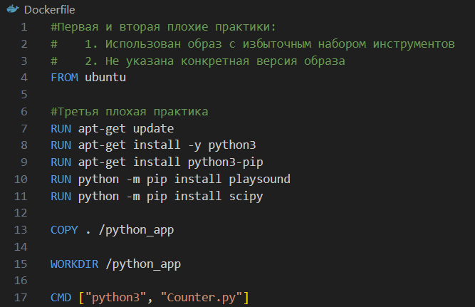
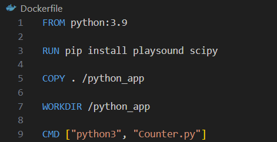

# Лабораторная работа 2

### Цель работы

Написать корректно работающий Dockerfile, содержащий не менее 3 плохих практик, и описать их, затем исправить в другом файле.

### Ход работы

1. Dockerfile

2. Описание плохих практик 
    
    2.1. Первая плохая практика заключается в выборе в качестве базового образа ubuntu, так как это увеличивает размер создаваемого Docker-образа, а для выполнения показанной на рисунке выше команды целая операционная система не требуется (избыточность).
    
    2.2. Вторая плохая практика также связана с инструкцией FROM: не была указана версия ubuntu (использование самого последнего образа из репозитория может привести к возникновению проблем со сборкой при обновлении образа).

    2.3. Третья плохая практика - решение отказаться от объединения нескольких слоёв в один, так как это утяжеляет образ за счёт выделения места для каждого.

3. Исправление плохих практик

    

    3.1. В данном случае в качестве базового образа следует использовать pyton.

    3.2. Указать версию используемого образа (3.9).

    3.3 Объединить слои в один (RUN pip install playsound scipy).

4. Дополнительно

   В обоих файлах происходит копирование всего каталога (COPY . /python_app), а не конкретных файлов, что могло бы увеличить размер создаваемого образа и длительность его сборки.

5. Плохие практики по использованию контейнера

   5.1. Запуск процессов от имени root (для устранения возможной угрозы с помощью директивы USER установить пользователя).
   
   5.2. Взаимодействие с другим контейнером через внутренний IP-адрес, который может измениться после его перезапуска (следует использовать переменные среды для передачи имени узла и номера порта).
