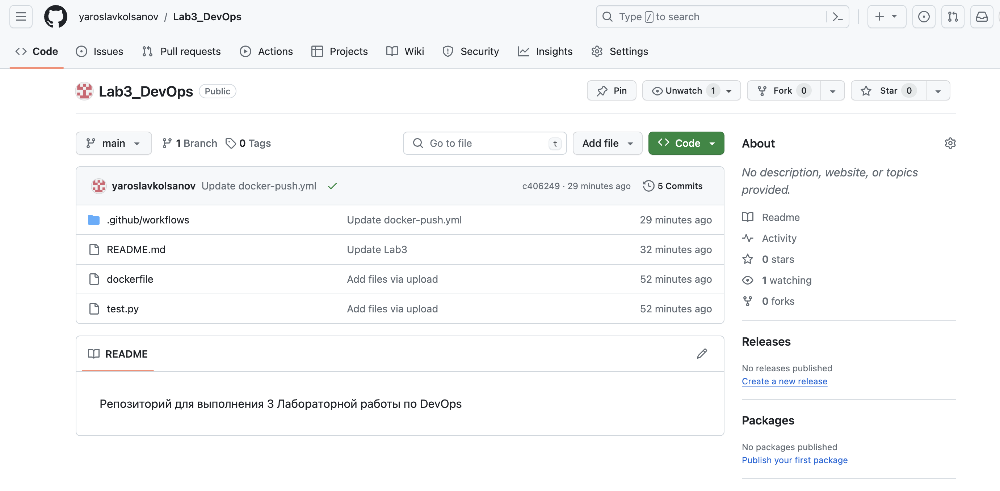
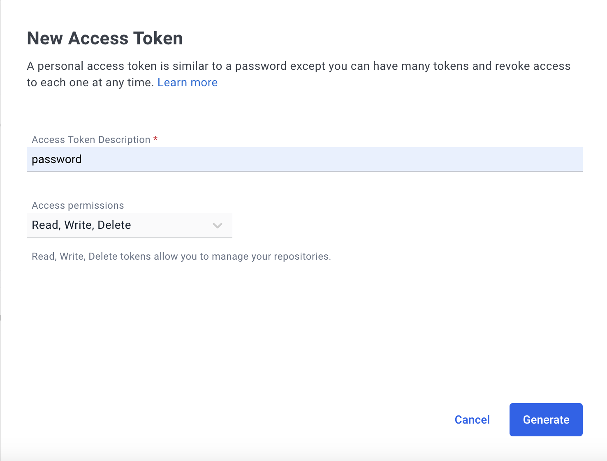
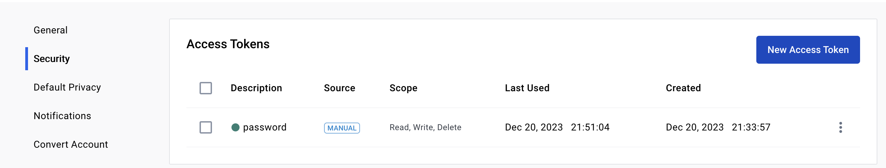
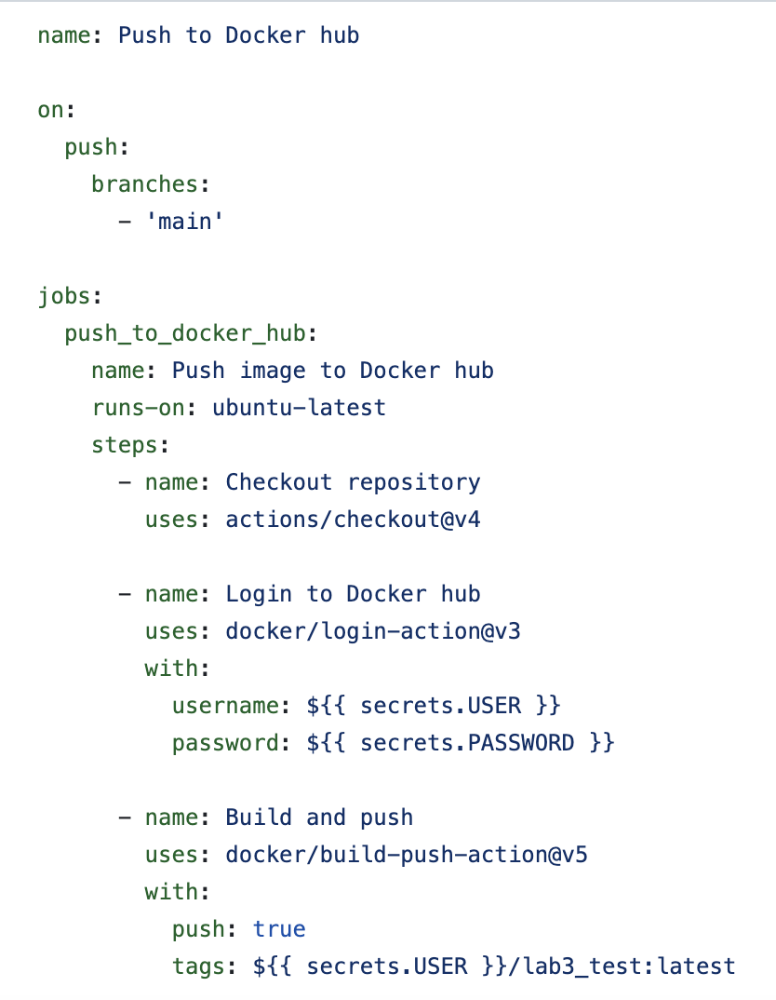

# Лабораторная работа 3

### Цель работы

Сделать, чтобы после пуша в ваш репозиторий автоматически собирался докер образ и результат его сборки сохранялся куда-нибудь.

### Ход работы

1. Для выполнения лабораторной работы был создан отдельный [репозиторий](https://github.com/yaroslavkolsanov/Lab3_DevOps). При пуше в этот репозиторий автоматически собирается докер образ и пушится на dockerhub.

2. В директории .github/workflows был создан yml-файл docker-push.yml, благодаря которому при push в ветку main происходит login на dockerhub, build докер образа и его push на dockerhub. Для подключения к dockerhub были созданы секреты USER и PASSWORD, где USER - это логин от аккаунта на dockerhub, а PASSWORD - сгенерированный access token, получение которого показано ниже

Содержимое yml-файла

